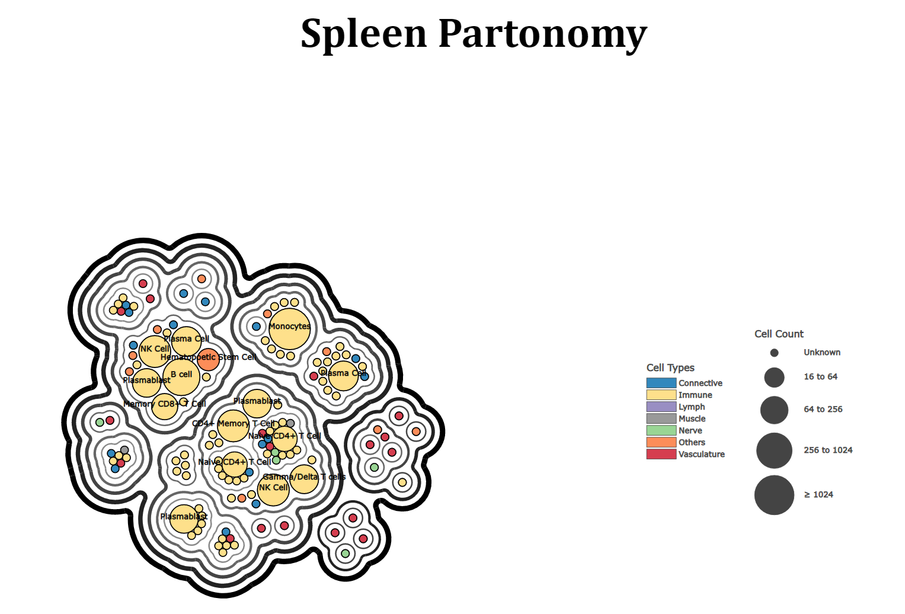

# Human Reference Atlas (HRA) - Bubble Treemaps

## Overview
HRA Bubble Treemaps is a fork of [bubble treemaps](https://github.com/grtlr/bubble-treemaps) that generates visualizations for the human body partonomy.

Anatomical structures (AS) are represented by nested contours, and associated cell types (CT) by colored circles within them. The size of circles is a function of the cell count, generally using the logarithmic scale.  

The following organs/structures are supported:
- Brain
- Kidney
- Large Intestine
- Lymph Node
- Spleen
- Skin
- Thymus
- Vasculature

Due to performance issues, Heart and Respiratory System datasets are disabled.
## Details
### Hierarchy Generation

**Column Grouping**

The partonomy hierarchy is constructed from the [flattened ASCT+B master tables](https://docs.google.com/spreadsheets/d/1tK916JyG5ZSXW_cXfsyZnzXfjyoN-8B2GXLbYD6_vF0/edit). Rows are grouped on common column values, starting from the highest anatomical structure level to the lowest, then moving towards common cell types. This can eventually be extended to grouping on common biomarkers.

**Tree Compression**

Certain cell types may be linked to higher level anatomical structures, compared to other cell types in the dataset. Grouping by column always produces a height-balanced tree, so the hierarchy for these cell types would include intermediate nodes grouped on empty cell values. Tree compression removes such nodes and links the cell type back to the appropriate higher-level structure.

**FTU Subtree Pruning**

When enabled, the subtree under the largest cluster composed of only FTU nodes are pruned, and the node with the pruned subtree is assigned a large weight to render it as an enlarged circle. This can be used to embed another SVG or image to display alternative content.

### Node Weight Assignment
Nodes are assigned weight based on cell count. Count information is extracted from [Azimuth reference files](https://azimuth.hubmapconsortium.org/references/). The scripts to extract this data can be [found here](https://github.com/DarshalShetty/asctb-azimuth-data-comparison). Since the hierarchy and count information come from different sources, a merge strategy needs be applied. The ideal merge uses cell ontology IDs to identify common cell types, otherwise the sources are merged using matching names or labels.
### Coloring Methods
Contours are assigned differential shades, with a thicker, darker edge at the root that diminishes while moving closer to the leaves.

Leaves, which are typically unique cell types, are represented by colored circles. These circles can be colored based on categorical information so that multiple cell types related by a common factor are assigned the same color. Leaf nodes that do not represent a cell type are colored in black to represent a missing link.
### Labeling Methods

**Top-N Cell Types**: Cell types are ranked on highest count using the [standard approach](https://en.wikipedia.org/wiki/Ranking#Standard_competition_ranking_.28.221224.22_ranking.29) and the top N are labeled, with a default N = 10.

**Large Clusters**

Anatomical structures linked to a minimum of N-cells are labeled, with a default N = 5.

**FTU Nodes**

Labels a collection of FTUs, where an FTU is the largest cluster having all descendant nodes marked as FTU.
### Legends
The cell type legend is based on the coloring approach selected. This would either be the categorical information, such as cell supertypes, or the unique cell types occurring in the dataset.

The cell count legend represents the approximate circle sizes observed for different cell count ranges. The circle sizes use logarithmic scaling, so updating the base of the log updates the content of this legend. The content is also based on the minimum and maximum values in the range of cell counts, and if count is unknown for any cell type.
### Text Descriptions
Title nodes are embedded into contours and circles that contain the label of the node along with a recursively-computed path taken to reach the node from the root. Most web browsers should render this as a UI tooltip.
